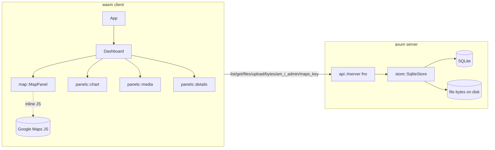

# Architecture

A standalone **microfrontend** visualising the firm's property allocation: a
2×2 dashboard (portfolio map, price-series chart, media/documents, deal details)
for a selected property. Built as a **Dioxus 0.7 fullstack** app (SSR + `#[server]`
functions in one binary) on top of `ev` (`architecture` + `uikit`) and `v_utils`.

It embeds inside a larger system that hands it an OAuth token + admin list, so
there is **no login** — admin actions are gated on a token the host puts on
`window.__reaAdminToken`, re-checked server-side.



## Modules (`src/`)
- `domain` — `Property`, `PropertyState`, value objects (`Money`, `ResearchUrl`,
  …), `Id` tags, `Entity`/`AggregateRoot`, and the `InState` `Specification`.
- `error` — `DomainError` (thiserror).
- `store` *(server-only)* — `SqliteStore` + the leaf `PropertyRepository` port,
  schema, `Row` `TryFrom`s, and `seed`. Specs filter **in memory** (`spec.holds`);
  SQL pushdown is descoped. File bytes live on disk; only metadata is in SQLite.
- `api` — the **only** client↔server seam. `#[server]` fns pull the store/config
  out of the fullstack context via `consume_context`.
- `config` *(server-only)* — `AppConfig` (`maps_api_key`, `db_path`, `data_dir`,
  `admin_token`, `admins`) over `v_utils` `LiveSettings`.
- `app` / `dashboard` / `panels` — UI. Selection is a root `Signal<Option<PropertyId>>`
  shared via context; each panel `use_resource`s keyed on it.
- `map` — **isolated** Google-Maps module; the only file touching the JS API. The
  inline-JS `extern` is fully `cfg(wasm32)`-gated, so the server build never links it.

## Persistence
- SQLite via `sqlx` (`runtime-tokio`, `sqlite`). One pool, schema run on startup.
- File bytes: `./data/properties/<property_id>/<file_id>__<filename>`.
- `price_series` is a **mock** (`v_utils::laplace_random_walk`, seeded per id),
  filled by `api::get_property` and never persisted.

## Build / run
Requires `nix develop` (provides `dx`, `nodejs`, the `wasm32` target).

```sh
nix develop
# 1. Tailwind v4 → assets/tailwind.css (keep running alongside dx serve):
cd real_estate_allocation
npx @tailwindcss/cli -i ./input.css -o ./assets/tailwind.css --watch &
# 2. Fullstack dev server (SSR + server fns + wasm client):
cd .. && dx serve --package real_estate_allocation
```

Seeding runs on first launch when the DB is empty (~6 properties across all three
states, plus a sample pic). Config (incl. `maps_api_key`, `admin_token`) is read
through `LiveSettings`; without a Maps key the map shows a placeholder.
