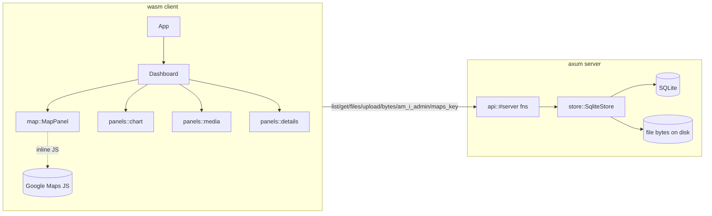

# Architecture

A standalone **microfrontend** visualising the firm's property allocation: a
2×2 dashboard (portfolio map, price-series chart, media/documents, deal details)
for a selected property. Built as a **Dioxus 0.7 fullstack** app (SSR + `#[server]`
functions in one binary) on top of `ev` (`architecture` + `uikit`) and `v_utils`.

It embeds inside a larger system that hands it an OAuth token + admin list, so
there is **no login** — admin actions are gated on a token the host puts on
`window.__reaAdminToken`, re-checked server-side.



## Modules (`src/`)
- `domain` — `Property`, `PropertyState`, value objects (`Money`, `ResearchUrl`,
  …), `Id` tags, `Entity`/`AggregateRoot`, and the `InState` `Specification`.
- `error` — `DomainError` (thiserror).
- `store` *(server-only)* — `SqliteStore` + the leaf `PropertyRepository` port,
  schema, `Row` `TryFrom`s, and `seed`. Specs filter **in memory** (`spec.holds`);
  SQL pushdown is descoped. File bytes live on disk; only metadata is in SQLite.
- `api` — the **only** client↔server seam. `#[server]` fns pull the store/config
  out of the fullstack context via `consume_context`.
- `config` *(server-only)* — `AppConfig` (`maps_api_key`, `db_path`, `data_dir`,
  `admin_token`, `admins`) over `v_utils` `LiveSettings`.
- `app` / `dashboard` / `panels` — UI. `app` owns the router (`Route`): `/` →
  `Home` (the full dashboard) and `/embed/overview` → the embed. Selection is a
  root `Signal<Option<PropertyId>>` shared via context; each panel `use_resource`s
  keyed on it.
- `embed` — the iframe-only `/embed/overview` surface (marketing bento: two
  property tiles that deep-link into `/?property=<id>`, a market note, and a
  client-side ROI calculator). Carries none of the dashboard shell/contexts. See
  **Embedding** below.
- `map` — **isolated** Google-Maps module; the only file touching the JS API. The
  inline-JS `extern` is fully `cfg(wasm32)`-gated, so the server build never links it.

## Property Info Standard
What we provide about a property (`domain::Property`). Required fields carry a
validating value object so a bad one can't enter the domain; optional fields are
`Option` and rendered only when present.

| Field | Type | Req. | Invariant / notes |
| --- | --- | --- | --- |
| `id` | `PropertyId` (`Id<PropertyTag>`, Uuid) | yes | minted on insert |
| `coords` | `Coords { lat, lng }` | yes | Google-Maps marker position |
| `price` | `Money` | yes | non-negative, finite |
| `state` | `PropertyState` | yes | `Purchased(Timestamp)` (carries the purchase instant) \| `Interesting` \| `Purchasing` |
| `research_url` | `ResearchUrl` | yes | non-empty http(s) — the reasoning post |
| `terms` | `Option<String>` | no | deal terms, free text |
| `deal` | `Option<DealStructure { equity_pct, debt_pct, notes }>` | no | deal structure |
| `loan` | `Option<LoanRates { rate_pct, term_years, lender }>` | no | rates if not bought outright |
| `additional_reasoning` | `Option<String>` | no | miscellaneous notes worth surfacing |
| `price_series` | `Vec<(Timestamp, f64)>` | — | dated weekly value estimates; **mock**, filled on read, never persisted |

Associated media (pics / pitch-deck / documents) are separate `PropertyFile`
records (`{ id, property_id, kind: Pic|PitchDeck|Document, filename, content_type }`),
not fields on `Property`.

## Embedding (iframe)
Routes under `/embed/*` are meant to be `<iframe>`d by a host page. Anything new
there must keep these invariants:
- **No frame-busting headers.** We send no `X-Frame-Options`/CSP today, so framing
  works. If a proxy ever fronts us, restrict per-route with
  `Content-Security-Policy: frame-ancestors <host-origins>` — never `X-Frame-Options: DENY`.
- **Links escape the frame.** In-app deep-links use `target="_top"` so a click
  navigates the *host* page, not the iframe. Destination host is still relative
  (`/?property=…`) — point it at the deployed app origin once decided.
- **Self-sizing.** No `min-h-screen`; the surface sizes to content (body bg is
  `main-black`). The host sets iframe height — add resize-`postMessage` only if
  auto-height is needed.
- **Shell-free.** An embed renders only its section: no `TopBar`, no dashboard
  contexts, no Maps script.

## Persistence
- SQLite via `sqlx` (`runtime-tokio`, `sqlite`). One pool, schema run on startup.
- File bytes: `./data/properties/<property_id>/<file_id>__<filename>`.
- `price_series` is a **mock** (`v_utils::laplace_random_walk`, seeded per id),
  filled by `api::get_property` and never persisted. Points carry real dates anchored
  to the purchase instant, so a long-held property's series runs out before today and
  the chart projects a dotted tail to now.

## Build / run
Requires `nix develop` (provides `dx`, `nodejs`, the `wasm32` target).

```sh
nix develop
# 1. Tailwind v4 → assets/tailwind.css (keep running alongside dx serve):
cd real_estate_allocation
npx @tailwindcss/cli -i ./input.css -o ./assets/tailwind.css --watch &
# 2. Fullstack dev server (SSR + server fns + wasm client):
cd .. && dx serve --package real_estate_allocation
```

The brand logo at `assets/logo.svg` is **generated, not committed** (gitignored):
the `ev_assets` flake input (pinned `github:EV-invest/assets`) is copied in by the
devShell / `nix run .#dev` / the pure build. Refresh it with `nix flake update ev_assets`.

Seeding runs on first launch when the DB is empty (~6 properties across all three
states, plus a sample pic). Config (incl. `maps_api_key`, `admin_token`) is read
through `LiveSettings`; without a Maps key the map shows a placeholder.
